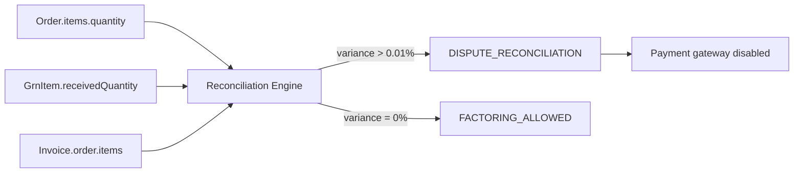

# HotelsVendors Platform — Operational API & Database Reference

## Infrastructure Stack
- **Runtime**: Next.js 16.2.4 (Turbopack) + TypeScript 5
- **Database**: PostgreSQL 14 via Prisma 6 + pg connection pooling
- **Cache/Queue**: Redis 7 via ioredis + BullMQ 5
- **Auth**: bcryptjs (12 salt rounds) + jose (HS256 JWT, 24h expiry)
- **Payments**: Paymob (HMAC-SHA512 verified), Fawry, InstaPay callbacks
- **Compliance**: ETA (Egyptian Tax Authority) e-invoicing — full SDK
- **Fintech**: Double-entry accounting ledger, 3-stream revenue model
- **Monitoring**: Sentry + Highlight

---

## Corporate-Only Sign-up Enforcement

### Registration Schema
`POST /api/v1/auth/staged-register`

```json
{
  "name": "Ahmed Hassan",
  "companyName": "Nile Grand Hotel Group",
  "taxId": "123456789",
  "email": "ahmed@nilegrand.com",
  "phone": "1001234567",
  "platformRole": "HOTEL",
  "password": "optional-secure-password"
}
```

### Enforcement Rules
| Rule | Location | Behavior |
|------|----------|----------|
| **9-digit Tax ID required** | Zod schema | `taxId` regex `/^\d{9}$/` — rejects any non-9-digit input with 400 |
| **Company name required** | Zod schema | `companyName` min 2 chars — individual names rejected |
| **accountType forced BUSINESS** | Route logic | User created with `accountType: "BUSINESS"` — `"INDIVIDUAL"` removed |
| **Tax ID uniqueness** | DB constraint | `Tenant.taxId @unique`, `Hotel.taxId @unique`, `Supplier.taxId @unique` |
| **Email uniqueness per tenant** | DB constraint | `@@unique([tenantId, email])` on User model |

---

## Seat Authorization Limits

### Seat Enforcement Utility
`lib/seat-limits.ts` — two-tier capacity check:

```typescript
enforceTenantSeatCapacity(tenantId)  // throws 403 if activeUsers >= tenant.seatCount
enforceHotelSeatCapacity(hotelId)    // throws 403 if activeUsers >= hotel.maxUsers
```

### Trigger Points
| Route | Action | Enforcement |
|-------|--------|-------------|
| `POST /api/v1/invite` | Send invite | `enforceTenantSeatCapacity()` before creating invite |
| `POST /api/v1/auth/staged-register` | Register | `seatCount` / `maxUsers` checked during user creation |

### Default Capacities
- **Tenant**: `seatCount: 5`, `maxUsers: 5`
- **Hotel**: `maxUsers: 10`

---

## 1% Infrastructure Split-Fee

### Fee Calculation
`POST /api/v1/payments/settle-with-fees`

```json
{
  "invoiceId": "ckxxxxx",
  "skipReconciliation": false
}
```

### Payout Breakdown
| Component | Rate | Recipient |
|-----------|------|-----------|
| Supplier net | 98.0% | Supplier |
| Platform fee | 1.0% | HotelsVendors |
| Hotel admin fee | 1.0% | Hotel group treasury |

### Ledger Entries (double-entry, immutable)
```json
[
  { "accountCode": "2020", "accountName": "Settlement Payable", "debit": 10000, "credit": 0 },
  { "accountCode": "1010", "accountName": "Platform Escrow", "debit": 0, "credit": 200 },
  { "accountCode": "1020", "accountName": "Supplier Clearing", "debit": 0, "credit": 9800 }
]
```

### Verification
- `lib/fintech/fee-calculator.ts` `calculateInfrastructureFee(invoiceTotal)` — pure function, deterministic
- `settleInvoiceWithFees()` — wrapped in Prisma `$transaction`, atomic commit
- Audit log entry `action: "SPLIT_SETTLEMENT_WITH_FEES"` created on every settlement
- Existing `AccountLedger` supports compensating reversal entries (immutable audit trail)

---

## 3-Way Reconciliation Guard

### Reconciliation Endpoint
`POST /api/v1/reconciliation`

```json
{
  "orderId": "ckxxxxx",
  "grnId": "ckxxxxx",
  "invoiceId": "ckxxxxx"
}
```

### Threshold Logic
| Variance | Status | Factoring |
|----------|--------|-----------|
| 0.00% | `MATCHED` | Allowed |
| 0.00% – 0.01% | `MINOR_DISCREPANCY` | Allowed |
| > 0.01% | `DISPUTE_RECONCILIATION` | **BLOCKED** |

### Dispute Actions (atomic transaction)
When variance exceeds 0.01%:
1. `Invoice.status → "DISPUTED"`
2. `Invoice.factoringStatus → "NOT_FACTORABLE"`
3. `GRN.status → "DISPUTED"`
4. `Order.status → "DISPUTED"`
5. Audit log `action: "DISPUTE_RECONCILIATION"` recorded

### Dependency Graph


---

## Key API Routes

### Auth & Registration
| Method | Route | Auth | Purpose |
|--------|-------|------|---------|
| POST | `/api/v1/auth/staged-register` | Public | Corporate registration with 9-digit Tax ID |
| POST | `/api/v1/auth/staged-verify-otp` | Public | Verify phone OTP |
| POST | `/api/v1/auth/login` | Rate-limited | Email+password login (5/min/IP) |
| POST | `/api/v1/auth/logout` | Required | Session invalidation + Redis blacklist |
| GET | `/api/v1/auth/me` | Required | Current user profile |

### Payments & Settlement
| Method | Route | Auth | Purpose |
|--------|-------|------|---------|
| POST | `/api/v1/payments/settle-with-fees` | Required | Settle invoice with 1% auto-split |
| POST | `/api/v1/payments/paymob-callback` | Public | Paymob webhook (HMAC verified) |
| POST | `/api/v1/payments/deposit` | Required | Create deposit payment link |
| POST | `/api/v1/payments/settle` | Required | Direct settlement (Net-30/60) |

### Reconciliation
| Method | Route | Auth | Purpose |
|--------|-------|------|---------|
| POST | `/api/v1/reconciliation` | Required | Run 3-way PO/GRN/Invoice check |
| GET | `/api/v1/reconciliation` | Required | Query reconciliation status |

### Orders & Invoicing
| Method | Route | Auth | Purpose |
|--------|-------|------|---------|
| GET | `/api/v1/orders/[id]` | Required | Full order with items, approvals, invoices |
| POST | `/api/v1/invoices` | Required | Create invoice with fraud check |
| POST | `/api/v1/invoices/[id]/eta-submit` | Required | Submit to ETA |

### Invitations
| Method | Route | Auth | Purpose |
|--------|-------|------|---------|
| POST | `/api/v1/invite` | Required | Send invite (seat capacity enforced) |
| GET | `/api/v1/invite` | Required | List tenant invites |

---

## Key Database Models

### Tenant (multi-tenant root)
```
id          String @id @default(cuid())
name        String
slug        String @unique
taxId       String? @unique         ← 9-digit Egyptian Tax Registration Number
seatCount   Int @default(5)         ← Max active users
maxUsers    Int @default(5)         ← Hard capacity ceiling
status      TenantStatus @default(ACTIVE)
```

### Invoice (with fee tracking)
```
id              String
invoiceNumber   String
total           Decimal
platformFee     Decimal @default(0)        ← 1% infrastructure fee
platformFeeRate Decimal @default(0)        ← 0.01
hotelAdminFeeRate Decimal @default(0)      ← 0.01
hotelAdminFeeAmount Decimal @default(0)    ← Calculated
paymentStatus   PaymentStatus
factoringStatus FactoringStatus
etaStatus       EtaStatus
```

### Order (purchase order)
```
id          String
orderNumber String
status      OrderStatus
total       Decimal
items       OrderItem[]           ← quantity, unitPrice
grns        Grn[]                 ← goods receipt notes
```

### Grn (goods receipt note)
```
id              String
grnNumber       String @unique
status          GrnStatus
items           GrnItem[]         ← expectedQty, receivedQty, rejectedQty
```

### JournalEntry (immutable double-entry)
```
id          String
entryNumber String @unique
date        DateTime
description String
lines       String                ← JSON array of {accountCode, accountName, debit, credit}
totalDebit  Decimal
totalCredit Decimal               ← MUST equal totalDebit (mathematical invariant)
status      JournalStatus         ← POSTED | REVERSED
```

---

## Security & Compliance Rules

1. **JWT sessions**: HS256, 24h expiry, Redis blacklist on logout, `clockTolerance: 60s`
2. **Rate limiting**: `5/min/IP` on login, `5/hour/IP` on registration
3. **Paymob HMAC**: SHA-512, constant-time comparison (`timingSafeEqual`), fail-closed if secret unset
4. **Supabase**: Keys moved from source code to env vars in this session
5. **Fraud detection**: `evaluateInvoiceForFraud()` runs on every invoice creation — auto-blocks transactions
6. **Reconciliation**: Variance > 0.01% blocks factoring triggers and routes to `DISPUTE_RECONCILIATION`
7. **Fee enforcement**: 1% split is hard-coded at `PLATFORM_FEE_RATE = 0.01` — cannot be overridden via API
8. **Audit log**: Immutable append-only via `AuditLog` with previous-hash chain for tamper detection

---

## Deployment
- **VPS**: 187.77.181.3 (nginx + Let's Encrypt SSL)
- **Database**: PostgreSQL 14 (port 5433), user: `hvuser`
- **Process**: PM2 managed, build via `npm run build:prod`
- **Redis**: Port 6379, used for rate limiting, session blacklist, BullMQ queues

*Generated: 2026-07-01 — HotelsVendors Platform Engineering*
