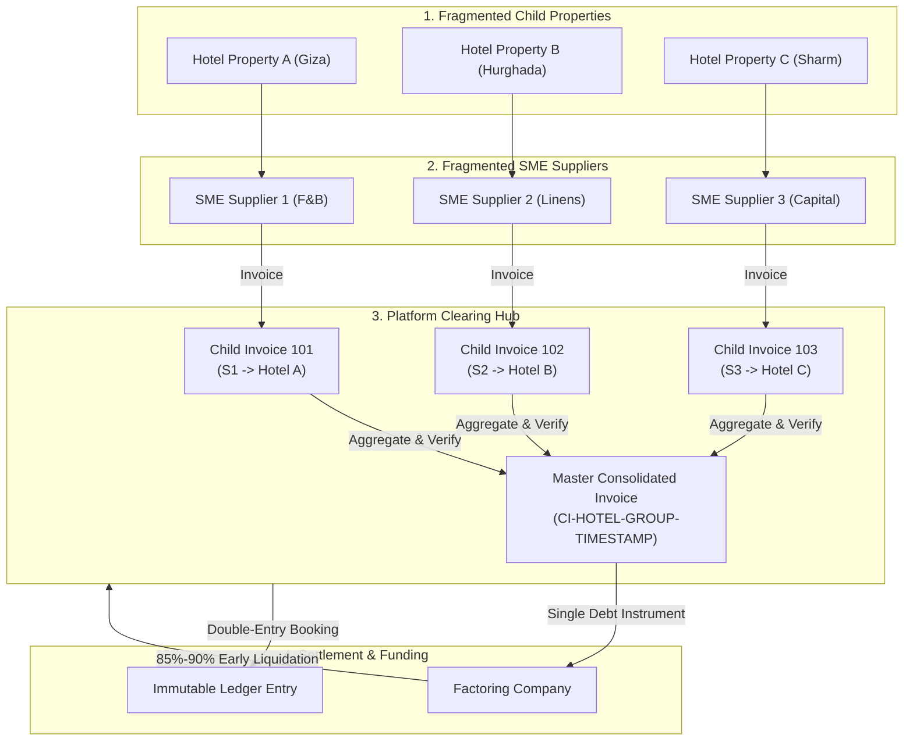

# Hotels Vendors Digital Procurement Hub
## System Renovation Framework (v1.0)
**Lead Enterprise Systems Architect Blueprint**

---

### Executive Summary

Hotels Vendors is a four-sided B2B marketplace connecting **Hotels (Buyers)**, **SME Suppliers (Sellers)**, **Shipping/Logistics Providers**, and **Factoring Companies (Liquidity Providers)**. 

To transition from a rough-draft codebase to an enterprise-grade financial and compliance infrastructure, this blueprint defines the core architectural mandates, directory configurations, technology recommendations, and linear execution phases. The framework addresses key business and technical requirements, including:
1. **The Reverse Factoring Aggregation Model** (Consolidation of fragmented SME invoices into corporate-backed Master Invoices).
2. **The Dual-Layer Agentic Ecosystem** (Absolute separation of Infrastructure Swarms from User-Facing Copilots).
3. **Predefined Command-Driven & SSE Traced UI** (Zero-trust interfaces eliminating prompt injection).
4. **Institutional Compliance Mandates** (ETA E-Invoicing sandbox/production cryptographic integration and FRA "Four-Eyes" double-entry ledger immutability).

---

### 1. The Reverse Factoring Aggregation Model (Business Layer)

#### 1.1 The Multi-Vendor Invoice Aggregation Pipeline

Factoring partners refuse to perform credit underwriting or manual audits on hundreds of small, fragmented SME invoices. Doing so generates high administrative overhead and excessive risk. 

Hotels Vendors acts as an **Aggregation Clearing Hub**. We group child invoices from individual hotel properties (e.g., F&B, linen, engineering) under a single parent Corporate Hotel Group. These are consolidated into a single **Master Consolidated Invoice** backed by the Hotel Group's corporate credit line.



#### 1.2 Programmatic Tri-Tier Monetization Model

The platform enforces a strict programmatic monetization engine operating across three concurrent, non-overlapping streams:

1. **Stream 1: FinTech Commission (Volume-Based Lead Gen)**
   - Charged to: *Factoring Company*
   - Mechanism: A pre-negotiated percentage fee ($\approx 1.5\%$) collected from the Factoring Partner on the total financed volume ($V_{\text{gross}}$). This fee is earned for delivering pre-vetted, fraud-proof, double-authorized, ETA-signed debt packages.
   $$\text{Revenue}_{S1} = V_{\text{gross}} \times r_{\text{commission}}$$

2. **Stream 2: Supplier Cash-Discount Delta (Time-Value Liquidity Spread)**
   - Charged to: *SME Supplier*
   - Mechanism: SME suppliers trade their traditional $45\text{-}90$ day corporate payment lag for guaranteed twice-a-week payouts. The supplier grants the platform an aggressive cash-discount rate ($r_{\text{supplier\_discount}} \approx 3\text{ to }5\%$). The platform pays the supplier immediately from the advance. In doing so, we capture the spread between the supplier's cash-discount rate and the factoring partner's underwriting/financing fee ($r_{\text{factor\_fee}} \approx 2\%$).
   $$\text{Revenue}_{S2} = V_{\text{gross}} \times (r_{\text{supplier\_discount}} - r_{\text{factor\_fee}})$$

3. **Stream 3: Hotel Administration Fee (Automated Treasury Management)**
   - Charged to: *Hotel Corporate Group*
   - Mechanism: A transaction fee ($1.0\text{ to }2.0\%$) billed directly to the Hotel Group for managing automated cash-flow cycles, single consolidated vendor payouts, and providing real-time multi-property audit trails. Additionally, vendors pay fixed SaaS subscription tiers ($r_{\text{subscription}}$) to access high-volume RFQs.
   $$\text{Revenue}_{S3} = (V_{\text{gross}} \times r_{\text{hotel\_admin}}) + \sum (\text{SaaS Subscriptions})$$

4. **Monetization Safety Invariant (Yield Spread Guard)**
   - Mechanism: The general ledger and invoicing engine enforce an automated **Yield Spread Guard**. The platform must **never** execute an accelerated payout if the spread between the Supplier Cash-Discount ($r_{\text{supplier\_discount}}$) and the Factoring Partner's underwriting fee ($r_{\text{factor\_fee}}$) drops below a net positive **1.5%** platform margin:
   $$(r_{\text{supplier\_discount}} - r_{\text{factor\_fee}}) \ge 1.5\%$$
   - Exception: Any deviation from this safety margin triggers an immediate transaction block and requires an explicit, dual-signed **Treasury Override** event. This bypass event must be fully logged in the immutable AuditLog with high-privilege credentials, transaction snapshot records, and business justification notes.

#### 1.3 The Onboarding Growth Loop (Shell Accounts)

To bypass cold-outreach friction, the platform utilizes an automated vendor onboarding loop:

```
[Hotel Group Onboarded] 
        │
        ▼ (Automated ETL)
[Extract Hotel's Active Supplier Registry]
        │
        ▼ (Generates Shell Accounts)
[Create 'Shell' Accounts in HotelSupplier Model] 
        │
        ▼ (Automated Secure Outbound Engine)
[Email/SMS/WhatsApp Invite with Tokenized Secret Key] 
        │
        ▼
[Supplier Clicks Secure Invitation Portal]
        │
        ▼ (Supplier enters credentials, validates Tax ID)
[Shell Account Promoted to 'Active' Tenant status]
        │
        ▼ (Immediate Value Unlock)
[Unlocks Guaranteed Twice-a-Week Accelerated Payments]
```

---

### 2. The Dual-Layer Agentic Ecosystem (Intelligence Layer)

The system enforces isolation between background orchestration and public interface components.

```
                    ┌──────────────────────────────────────────────┐
                    │            USER PORTAL INTERFACE             │
                    │   (Hotel, Supplier, Factor, Logistics Hub)   │
                    └──────────────────────┬───────────────────────┘
                                           │
                       REST HTTP /api/v1 (Read-Only GET)
                                           │
                                           ▼
┌──────────────────────────────────────────────────────────────────────────────────┐
│                      LAYER B: PORTAL ASSISTANT COPILOTS                          │
│                                                                                  │
│   ┌────────────────────┐ ┌────────────────────┐ ┌────────────────────┐           │
│   │  Cashflow Advisor  │ │ Compliance Scanner │ │ Logistics Pilot    │ ...       │
│   │  (Factoring/AP)    │ │ (ETA/Tax Auditing) │ │ (Route Optimizer)  │           │
│   └────────────────────┘ └────────────────────┘ └────────────────────┘           │
│   - Embedded sandboxed conversational agents.                                    │
│   - Session-locked & tenant-constrained context.                                 │
│   - ZERO database mutation rights. Can only read pre-validated data payloads.    │
└──────────────────────────────────────────────────────────────────────────────────┘
                                           ▲
                                           │ Secure Persistence (Database & Redis)
                                           ▼
┌──────────────────────────────────────────────────────────────────────────────────┐
│                    LAYER A: INFRASTRUCTURE ENGINE SWARM                          │
│                                                                                  │
│   ┌────────────────────┐ ┌────────────────────┐ ┌────────────────────┐           │
│   │ LeadScout Agent    │ │ ETASigning Engine  │ │ LedgerAuditor      │ ...       │
│   │ (Outreach/Growth)  │ │ (Hardware/PKCS#11) │ │ (FRA Guardrail)    │           │
│   └────────────────────┘ └────────────────────┘ └────────────────────┘           │
│   - Runs under-the-hood via BullMQ persistent workers.                           │
│   - Handles write access, heavy computational logic, and external API sync.       │
│   - Subject to dual-authorization check gates and immutable audit logging.        │
└──────────────────────────────────────────────────────────────────────────────────┘
```

#### 2.1 Layer A: The Infrastructure Engine Swarm (Under-the-Hood Operations)
- **Role:** Heavy-lifting, operations, data enrichment, system synchronization.
- **Execution Environment:** Background processes executed via BullMQ queues (`growth`, `operations`, `intelligence`, `execution`) mapped over Docker-managed Ollama instances.
- **System Rights:** Secure access to execute database transactions, canonicalize ETA invoices, compute logistics routing matrices, and generate lead lists.
- **Access Gate:** Blocked from direct public client requests. Runs through an asynchronous job queue model.

#### 2.2 Layer B: The Portal Assistant Copilots (User-Facing Embedded Virtual Coworkers)
- **Role:** User-facing virtual advisors embedded in specific dashboard modules (e.g., `CashflowAdvisor` in Fintech, `ComplianceScanner` in ETA compliance).
- **Security Envelope:** **Strictly read-only.** Copilots operate solely by fetching pre-vetted JSON structures from versioned REST endpoints (`/api/v1/...`). They do not bypass authorization logic, have no direct database connection pools, and are blocked from invoking write-queries or mutations.
- **Interaction Style:** Provide conversational context and actionable recommendations based on tenant scope.

---

### 3. Command-Driven & Guided Pipeline UI (UX Constraint)

To eliminate the risks of LLM prompt manipulation, script injections, and administrative authorization bypasses, natural language inputs are sandboxed.

#### 3.1 Predefined Slash-Commands (/) & Explicit Action Selection
- **The Core Constraint:** **No natural-language input fields can trigger state changes.** 
- **The Interface Paradigm:** All actions (e.g., triggering invoice consolidation, requesting underwriting, applying digital signatures, routing to a GM) must be executed exclusively via:
  1. Predefined Slash-Commands (`/consolidate`, `/approve [id]`, `/factor [id]`, `/override [id]`) inside a command-line interface component.
  2. High-visibility action-choice buttons wired directly to authenticated, type-safe API handlers.
- **The Natural Language Sandbox:** Public text input zones are restricted to a customer support help-desk widget. This widget uses a distinct API route with zero backend mutation privileges.

#### 3.2 SSE / WebSocket Live Execution Tracing
Asynchronous operations (e.g., aggregating invoices, invoking ETA PKCS#11 signature modules, transmitting packages to the government gateway) stream their internal milestones in real time. 
Rather than showing a generic loading spinner, the UI renders step-by-step progress ticks via **Server-Sent Events (SSE)**:

```
[14:10:02] [⏳] Initiating multi-vendor child invoice aggregation...
[14:10:03] [✓] Validated tenant isolation. Scoped to Tenant: Egypt-Palace-Group.
[14:10:05] [✓] Consolidated 14 underlying supplier invoices into CI-HOTEL-78902.
[14:10:06] [⏳] Fetching detached digital signature token from HashiCorp Vault kv-v2...
[14:10:07] [✓] Secret resolved. Handshake initiated with Egypt-Trust soft-HSM driver.
[14:10:08] [✓] Canonical string generated and signed (Detached CADES-BES PKCS#7).
[14:10:10] [⏳] Transmitting payload to Egyptian Tax Authority production gateway...
[14:10:12] [✓] ETA response accepted. UUID: 7fa01-92b83-cda92. Status: VALID.
[14:10:13] [✓] Double-entry ledger booked (JE-DISB-78902). Transaction complete.
```

---

### 4. Institutional Compliance Mandates (Security Layer)

#### 4.1 Egyptian Tax Authority (ETA) E-Invoicing Engine

All invoices issued on the marketplace must integrate with the Egyptian Tax Authority e-invoicing API using the following implementation specifications:

```
┌────────────────────────────────────────────────────────┐
│              PLATFORM ORIGINAL INVOICE JSON            │
└───────────────────────────┬────────────────────────────┘
                            │
                            ▼
┌────────────────────────────────────────────────────────┐
│             1. ALPHABETICAL CANONICALIZATION           │
│  - Sort JSON keys alphabetically at every object depth. │
│  - Convert values to UTF-8 strings.                    │
│  - Strip all leading/trailing whitespace & newlines.   │
│  - Normalize decimals (2 places, e.g., "150.00").     │
└───────────────────────────┬────────────────────────────┘
                            │
                            ▼
┌────────────────────────────────────────────────────────┐
│             2. SECURE SECRET RETRIEVAL                 │
│  - Query HashiCorp Vault /v1/secret/data/path to       │
│    resolve Egypt Trust USB PIN or Soft-HSM password.   │
└───────────────────────────┬────────────────────────────┘
                            │
                            ▼
┌────────────────────────────────────────────────────────┐
│            3. DETACHED SIGNATURE GENERATION            │
│  - Pass canonical string and PIN to PKCS#11 module.    │
│  - Invoke dynamic Linux HSM library (libepsign.so).    │
│  - Create SHA-256 hash, sign via RSA private key.      │
│  - Format as detached PKCS#7 (CAdES-BES) envelope.     │
└───────────────────────────┬────────────────────────────┘
                            │
                            ▼
┌────────────────────────────────────────────────────────┐
│              4. ETA GATEWAY SUBMISSION                 │
│  - Bundle signed document into final ETA envelope.     │
│  - POST package over TLS 1.3 to ETA Sandbox/Prod APIs.  │
└────────────────────────────────────────────────────────┘
```

1. **Canonicalization:** Under the ETA e-invoicing schema v1.0, documents must be canonicalized using strict UTF-8 sorting:
   - Sort JSON keys alphabetically at every level.
   - Strip all whitespaces, newlines, and carriage returns inside string nodes.
   - Normalize numerical precision (decimals must be strings formatted to a strict precision, e.g., `150.00`).
2. **Cryptographic Detached Signatures:** Documents require a detached PKCS#7 / CADES-BES signature.
3. **PKCS#11 Hardware / Soft-HSM Driver:** The server must call dynamic Linux PKCS#11 driver wrappers (e.g., `libepsign.so` or Egypt Trust libraries) interfacing with a soft-HSM client or a network-connected hardware security module (HSM) that holds the taxpayer's private key.
4. **Secrets Management:** The passphrase to access the PKCS#11 module must be resolved dynamically at runtime using a HashiCorp Vault Kv-v2 secrets engine path structure: `/v1/secret/data/tenants/{tenantId}/eta-pin`. No credentials may exist in local `.env` files or long-term system memory.

#### 4.2 Financial Regulatory Authority (FRA) Invariants

All factoring operations must align with the regulatory mandates of the Egyptian Financial Regulatory Authority (FRA):

1. **The "Four-Eyes" Dual Authorization Gate**
   The "Four-Eyes" dual-control validation is a mandatory, unconditional constraint for **all** consolidated invoice submissions and factoring liquidations, completely stripping out any monetary thresholds to prevent order-splitting fraud. No consolidated invoice transaction can be submitted to the factoring partner or liquidated under a single identity. The system requires two separate role-based digital signatures to commit a state transition:
   - **Signature A (Originator/Clerk):** Initiates the multi-property invoice aggregation, creates the consolidated invoice asset, and drafts the factoring request.
   - **Signature B (Verifier/Financial Controller or GM):** Independently audits the underlying ledger rows, verifies the composite hotel group risk indices, and authorizes the final transmission and early liquidation.
   - *Audit Trail:* Each approval logs the actor's `userId`, `role`, `timestamp`, `ipAddress`, `userAgent`, and a SHA-256 snapshot of the record state before and after signature in the append-only log.

2. **Absolute General Ledger Immutability**
   The platform's double-entry bookkeeping system (`JournalEntry` model) is strictly write-once, append-only.
   - **No updates or deletes:** Database access controllers (`PrismaClient`) for financial general ledgers must block all `update`, `updateMany`, `delete`, and `deleteMany` operations.
   - **Compensating Journals:** Discrepancies, disputes, or cancellations are corrected by posting a formal balancing compensating entry (`REVERSED` state) and booking a subsequent, corrected transaction.

---

### 5. Proposed Architectural Directory Layout

This layout implements the required Next.js 16.2.4 App Router structure (prioritizing root `app/` over `src/app/`) and separates business modules from platform helpers.

```
/
├── app/                                 # ACTIVE NEXT.JS APP ROUTER ROOT
│   ├── (marketing)/                     # PUBLIC: Branding, Lead Gen, SEO
│   │   ├── layout.tsx                   # Marketing Shell (Navigation, Footer)
│   │   ├── page.tsx                     # Premium B2B Landing Page
│   │   └── waiting-list/                # Portal for waiting list
│   ├── (auth)/                          # PUBLIC: Authentication
│   │   ├── layout.tsx                   # Unified Auth Container
│   │   └── login/                       # Role-Locked Login page
│   ├── (dashboard)/                     # PRIVATE: Role-Specific Portals
│   │   ├── layout.tsx                   # Shell with Sidebar, Header, & Tenant Scope
│   │   ├── hotel/                       # Hotel Portal (Consolidated PO/Invoices)
│   │   │   └── page.tsx
│   │   ├── supplier/                    # Supplier Central (Shell onboarding link)
│   │   │   └── page.tsx
│   │   ├── factoring/                   # Factor Portal (Underwriting, Dual Sign-off)
│   │   │   └── page.tsx
│   │   └── admin/                       # Platform Fee Tracker & Audit Log Viewer
│   │       └── page.tsx
│   ├── api/                             # VERSIONED REST API ENDPOINTS
│   │   └── v1/
│   │       ├── auth/                    # Tenant-Aware JWT Session Management
│   │       ├── tenants/                 # Tenant Profile & Context Isolation
│   │       ├── factoring/               
│   │       │   ├── consolidate.ts       # Groups child invoices into Master consolidated
│   │       │   ├── underwriting.ts      # Underwriting logic with Factor API
│   │       │   └── approve.ts           # Dual-Authorization Gate checker
│   │       ├── eta/                     
│   │       │   ├── canonicalize.ts      # Implements UTF-8 alphabetical sorting
│   │       │   └── submit.ts            # Connects to HSM & POSTs to ETA gateway
│   │       └── audit/                   # Read-Only immutable audit trails
│   ├── globals.css                      # ACTIVE global styles (Tailwind v4 syntax)
│   ├── layout.tsx                       # ROOT: Global Providers, fonts (Inter/Outfit)
│   └── middleware.ts                    # Edge-guarded server RBAC & tenant scoping
│
├── components/                          # SHARED COMPONENT INVENTORY
│   ├── ui/                              # Pure UI primitives (Radix + Tailwind v4)
│   ├── layout/                          # Dashboard shell, responsive navigation
│   ├── dashboards/                      # Domain Modules
│   │   ├── hotel/                       # PO builders, invoice grouping components
│   │   ├── supplier/                    # Inventory catalogs, shell activation form
│   │   └── factoring/                   # Debt package cards, "Four-Eyes" signing UI
│   ├── ai-assistant/                    # Copilot sandboxed interface components
│   └── shared/                          # SSE tracing visualizers, tenant selector
│
├── lib/                                 # UNDER-THE-HOOD BUSINESS LOGIC
│   ├── prisma.ts                        # Prisma DB Client Singleton
│   ├── tenant/                          
│   │   └── scope.ts                     # Strict context query scoping injectors (G1)
│   ├── auth/                            
│   │   └── rbac.ts                      # Server-side RBAC validation helper (G2)
│   ├── eta/                             
│   │   ├── canonicalizer.ts             # Alphabetical sorter library
│   │   ├── pkcs11-signer.ts             # HSM driver bridge (libepsign.so)
│   │   └── validation.ts                # Zod schemas matching ETA validation API
│   ├── fintech/                         
│   │   ├── fee-calculator.ts            # Mathematical precision fee model (S1/S2/S3)
│   │   ├── accounting-ledger.ts         # Append-only ledger generator
│   │   └── key-vault.ts                 # HashiCorp Vault secrets engine KV-v2 integration
│   └── swarm/                           # SWARM DEVELOPMENT OPERATIONS
│       ├── director.ts                  # Strategic orchestrator 
│       ├── scheduler.ts                 # BullMQ squad job orchestrator
│       ├── worker-entry.ts              # System worker runner
│       └── assistants/                  # Sandboxed Layer B copilot logic definitions
│           ├── cashflow-advisor.ts      
│           └── compliance-scanner.ts    
│
└── docs/                                # ARCHITECTURAL SPECIFICATIONS
    ├── SYSTEM_RENOVATION_FRAMEWORK.md   # [THIS BLUEPRINT]
    └── audit-log.md                     # Security audit validations
```

---

### 6. Recommended Technology Stack & Security Tools

To maintain the architectural invariants, we recommend integrating the following specialized tools:

| Module | Recommended Technology | Security / Engineering Justification |
| :--- | :--- | :--- |
| **Database ORM** | `Prisma` + `PostgreSQL` | Supports row-level transaction safety. Enables middle-tier query filters for tenant isolation. |
| **Audit Immutability** | `PostgreSQL Trigger Engines` | Restricts `UPDATE` and `DELETE` requests directly at the database engine level for the `JournalEntry` and `AuditLog` tables. |
| **ETA Key Signing** | `node-pkcs11` | A Node.js module that interfaces with HSM drivers (PKCS#11 standard) for hardware token integration without exposing raw keys. |
| **Secrets Engine** | `HashiCorp Vault KV-v2` | Provides dynamic secrets management. Secrets are resolved over authenticated HTTPS using short-lived tokens, bypassing hardcoded configurations. |
| **Encryption-at-Rest** | `AES-256-GCM` | Encrypts taxpayer IDs, bank details, and personally identifiable information (PII) before database persistence. |
| **API Input Validation** | `Zod` | Enforces runtime schemas and type-safety boundaries at the server route level. |
| **UI Streaming** | `Server-Sent Events (SSE)` | Simple HTTP-based stream protocol. Lightweight alternative to WebSockets, suitable for unidirectional log tracing. |

---

### 7. Linear Phase Breakdown & Implementation Roadmap

```
┌────────────────────────────────────────────────────────┐
│        PHASE 1: SECURE MULTI-TENANCY & AUDITING        │
│        (Days 1 - 7)                                    │
└───────────────────────────┬────────────────────────────┘
                            │
                            ▼
┌────────────────────────────────────────────────────────┐
│        PHASE 2: REVERSE FACTORING PIPELINE MVP         │
│        (Days 8 - 14)                                   │
└───────────────────────────┬────────────────────────────┘
                            │
                            ▼
┌────────────────────────────────────────────────────────┐
│        PHASE 3: ETA COMPLIANCE INTEGRATION             │
│        (Days 15 - 22)                                  │
└───────────────────────────┬────────────────────────────┘
                            │
                            ▼
┌────────────────────────────────────────────────────────┐
│        PHASE 4: COMMAND-DRIVEN UI & SSE STREAMING      │
│        (Days 23 - 30)                                  │
└───────────────────────────┬────────────────────────────┘
                            │
                            ▼
┌────────────────────────────────────────────────────────┐
│        PHASE 5: DUAL-LAYER AGENT DEPLOYMENT            │
│        (Days 31 - 37)                                  │
└───────────────────────────┬────────────────────────────┘
                            │
                            ▼
┌────────────────────────────────────────────────────────┐
│        PHASE 6: END-TO-END DEPLOYMENT & TESTING        │
│        (Days 38 - 45)                                  │
└────────────────────────────────────────────────────────┘
```

#### Phase 1: Secure Multi-Tenancy & Auditing (Days 1 - 7)
- **Goal:** Establish multi-tenant query controls (G1), server-side RBAC (G2), and an append-only audit trail (G3), alongside offline cryptographic emulators.
- **Deliverables:**
  1. Complete the multi-tenant scope helper `lib/tenant/scope.ts`.
  2. Implement global middleware routing restrictions to prevent cross-tenant request exposure.
  3. Deploy PostgreSQL table constraints to prevent `UPDATE` and `DELETE` operations on `JournalEntry` and `AuditLog` records.
  4. Develop a mock **'Soft-HSM/ETA Emulation Layer'** that mimics all production inputs/outputs of the PKCS#11 hardware module. This lets the core data models and UI forms be validated and tested offline, entirely independent of host-OS native USB PKCS#11 drivers.
- **Verification:** Write automation scripts that attempt cross-tenant database reads and direct updates to audit records to confirm authorization rejections, and execute offline cryptographic signing tests using the Soft-HSM mock layer.

#### Phase 2: Reverse Factoring Pipeline MVP (Days 8 - 14)
- **Goal:** Build the fintech invoice consolidation core, calculate tri-tier monetization, and implement the supplier shell onboarding flow.
- **Deliverables:**
  1. Build the REST endpoint `/api/v1/factoring/consolidate` to aggregate child invoice items into a parent structure.
  2. Implement `/lib/fintech/fee-calculator.ts` with strict calculations for:
     - Stream 1: Factor Lead-Gen Fee
     - Stream 2: Supplier Early Liquid Cash-Discount Spread
     - Stream 3: Hotel Treasury Administration Fee
  3. Configure the `HotelSupplier` shell generation system to parse vendor details and dispatch invite links.
- **Verification:** Seed properties with mock supplier transactions, trigger consolidation, and check the math against independent financial spreadsheets.

#### Phase 3: ETA Compliance Integration (Days 15 - 22)
- **Goal:** Develop the canonical envelope formatter and establish PKCS#11 key signing interfaces.
- **Deliverables:**
  1. Build the canonicalization helper `lib/eta/canonicalizer.ts` to sort and strip JSON payloads.
  2. Implement `lib/fintech/key-vault.ts` to retrieve HSM PIN keys at runtime from HashiCorp Vault.
  3. Set up `node-pkcs11` signature generators using the ETA sandbox endpoints.
- **Verification:** Submit signed mock envelopes to the ETA sandbox gateway to verify status returns.

#### Phase 4: Command-Driven UI & SSE Streaming (Days 23 - 30)
- **Goal:** Construct the predefined UI action handlers, restrict text entry fields, and build the SSE tracking system.
- **Deliverables:**
  1. Replace custom text boxes with action-specific buttons and a Slash-Command UI terminal.
  2. Sandbox the customer support assistant window to restrict backend execution routes.
  3. Implement the server-side SSE event stream in `/api/v1/factoring/consolidate` to push logs during processing steps.
- **Verification:** Run a consolidation task and verify that the UI updates progress markers in real time.

#### Phase 5: Dual-Layer Agent Deployment (Days 31 - 37)
- **Goal:** Launch Layer A and Layer B agent instances, separating background jobs from chat advisors.
- **Deliverables:**
  1. Restructure `/lib/swarm/assistants` as read-only modules pulling from `/api/v1/` routes.
  2. Map Layer A system operations (e.g., scraping, database syncing) to the background queue system.
  3. Integrate `CashflowAdvisor` and `ComplianceScanner` copilots directly into their respective dashboard panels.
- **Verification:** Test copilot questions in the UI and confirm they cannot trigger record creation or modification.

#### Phase 6: End-to-End Deployment & Testing (Days 38 - 45)
- **Goal:** Run integration tests across all components, conduct security audits, and prepare the production launch package.
- **Deliverables:**
  1. Deploy the platform in the standalone Next.js configuration (`output: 'standalone'`).
  2. Run security and performance audits on transaction loads.
  3. Hand over the operation manual to the administrator team.
- **Verification:** Simulate a complete business cycle: hotel property ordering $\rightarrow$ invoice consolidation $\rightarrow$ factor approval $\rightarrow$ HSM signing $\rightarrow$ ETA gateway verification $\rightarrow$ final payout ledger booking.

---
**Document Status: Awaiting C-Suite review and signature.**
*Signed: Lead Enterprise Systems Architect*
