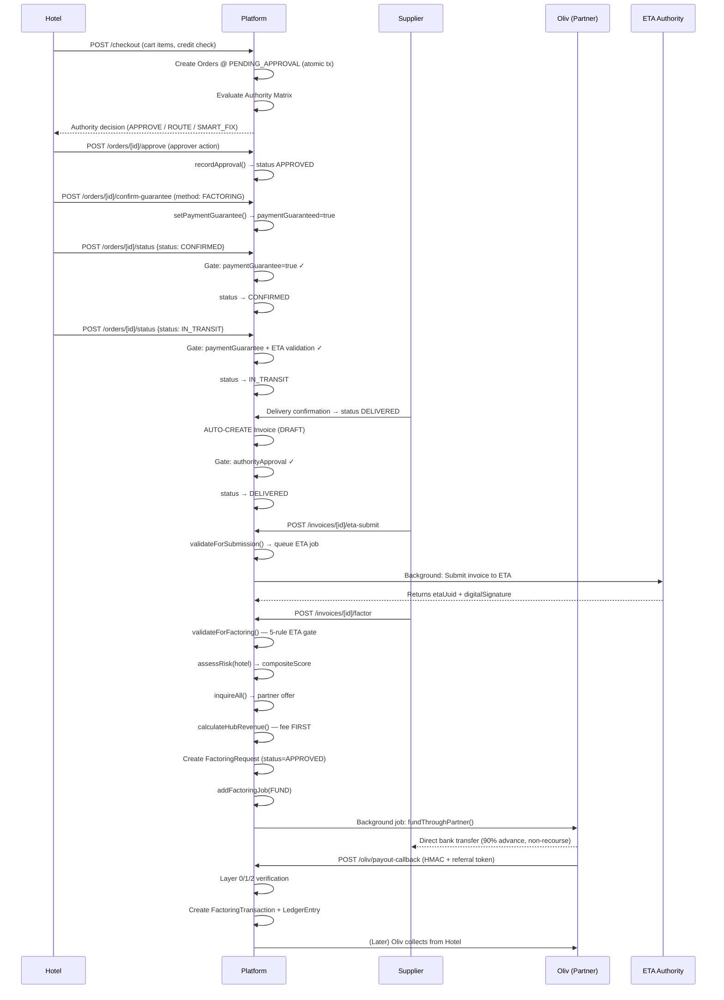

# Deliverable 2 — Order→Factoring State Map

> Read-only analysis. Every claim cites `file_path:line_number`. The full fintech compliance gate (G10) is referenced throughout.

---

## 2.1 Party Flow Overview

The platform involves **five parties** in a single transaction lifecycle. Each party has a distinct role and handoff point:

| Stage | Party | Action | Key File |
|---|---|---|---|
| 1 | Hotel (Buyer) | Creates cart, initiates checkout | `app/api/v1/checkout/route.ts` |
| 2 | Platform | Evaluates Authority Matrix, captures credit | `lib/auth/authority-matrix.ts` |
| 3 | Hotel (Approver) | Approves order (multi-level) | `app/api/v1/orders/[id]/approve/route.ts` |
| 4 | Hotel (Financial) | Confirms payment guarantee method | `app/api/v1/orders/[id]/confirm-guarantee/route.ts` |
| 5 | Platform | Routes through state machine to DELIVERED | `app/api/v1/orders/[id]/status/route.ts`, `lib/auth/state-machine.ts` |
| 6 | Supplier | Delivers goods, invoice auto-created | `app/api/v1/orders/[id]/status/route.ts:73-102` |
| 7 | Integration Lead | Submits invoice to ETA | `app/api/v1/invoices/[id]/eta-submit/route.ts` |
| 8 | Fintech Orchestrator | Validates ETA, runs risk, queries partners | `app/api/v1/invoices/[id]/factor/route.ts` |
| 9 | Factoring Partner (Oliv) | Disburses funds to supplier | `lib/payments/oliv/index.ts` |
| 10 | Factoring Partner → Hotel | Collects repayment from hotel | `app/api/v1/oliv/payout-callback/route.ts` |

---

## 2.2 State Machine — Order Lifecycle

**Source:** `lib/auth/state-machine.ts:15-26` (`VALID_TRANSITIONS` map)

```
DRAFT
  ├──▶ PENDING_APPROVAL    (checkout creates orders at this state: app/api/v1/checkout/route.ts:197)
  └──▶ CANCELLED

PENDING_APPROVAL
  ├──▶ APPROVED             (via /orders/[id]/approve: app/api/v1/orders/[id]/status/route.ts:18)
  ├──▶ REJECTED            (via /orders/[id]/approve)
  └──▶ CANCELLED

APPROVED
  └──▶ CONFIRMED            (GATED: requires paymentGuaranteed=true)
      └──▶ IN_TRANSIT        (GATED: requires paymentGuarantee + ETA validation)
          ├──▶ PARTIALLY_DELIVERED
          ├──▶ DELIVERED       (GATED: requires authorityApproval; AUTO-CREATES Invoice)
          └──▶ DISPUTED

DELIVERED
  └──▶ DISPUTED             (terminal dispute path)

CANCELLED / DISPUTED — terminal
```

### Transition Gates (lib/auth/state-machine.ts:73-77):
| From → To | Gate Requirement | Enforced In |
|---|---|---|
| APPROVED → CONFIRMED | `paymentGuarantee: true` | `app/api/v1/orders/[id]/status/route.ts:61-68`; `lib/auth/state-machine.ts:132-138` |
| CONFIRMED → IN_TRANSIT | `paymentGuarantee: true` + `etaValidation: true` | Same |
| IN_TRANSIT → DELIVERED | `authorityApproval: true` | Same |

### Invoice Auto-Creation at DELIVERED:
- `app/api/v1/orders/[id]/status/route.ts:73-102` — when status flips to DELIVERED, an `Invoice` record is created (if not already exists) with `status: "DRAFT"`, `paymentStatus: "UNPAID"`, 30-day due date
- `lib/auth/state-machine.ts:77` — `getTransitionGate("IN_TRANSIT", "DELIVERED")` requires `authorityApproval`
- Audit snapshot: `app/api/v1/orders/[id]/status/route.ts:149-165` — logs `beforeState` (status + paymentGuaranteed) and `afterState`

---

## 2.3 Authority Matrix Evaluation

**Source:** `lib/auth/authority-matrix.ts:222-357` (`evaluateAuthority`)

When checkout creates an order (`app/api/v1/checkout/route.ts:261-268`), the Authority Matrix is evaluated per order. The matrix is **database-driven** (`AuthorityRule` model, `lib/auth/authority-matrix.ts:251-262`) merged with built-in rules (`lib/auth/authority-matrix.ts:83-212`).

### Built-in Rules (priority order):
| Priority | Rule ID | Conditions | Action | G10 Enforcement |
|---|---|---|---|---|
| 1000 | `rule_critical_block` | Hotel risk tier = CRITICAL | REJECT | `requiresPaymentGuarantee=true`, `requiresEtaValidation=true` |
| 950 | `rule_eta_invalid` | Universal | REJECT | Same |
| 900 | `rule_payment_guarantee_gate` | Universal | REQUIRE_PAYMENT_GUARANTEE | `requiresPaymentGuarantee=true` |
| 850 | `rule_smart_fix` | Hotel risk tier = HIGH | SMART_FIX_REQUIRED | `requiresPaymentGuarantee=true` |
| 800 | `rule_high_value_dual` | Order > 500K EGP, Hotel tier = CORE | DUAL_SIGN_OFF | Both gates |
| 750 | `rule_gm_route` | Order > 100K EGP, requester = CLERK | ROUTE_TO_GM | PG=true |
| 700 | `rule_auto_approve` | Order < 50K EGP, risk tier = LOW | AUTO_APPROVE | PG + ETA true |
| 650 | `rule_fc_route` | Order > 50K EGP, requester = DEPARTMENT_HEAD | ROUTE_TO_FINANCIAL_CONTROLLER | PG=true |
| 600 | `rule_owner_route` | Order > 1M EGP | REQUIRE_OWNER | Both gates |
| 500 | `rule_default` | Universal | APPROVE | Both gates |

> **G10 Note:** `requiresPaymentGuarantee` and `requiresEtaValidation` are *always forced to true* for DB rules: `lib/auth/authority-matrix.ts:267-274`. This is the non-negotiable governance rule.

### Smart Fix Injection (G10):
- `lib/auth/authority-matrix.ts:286-299` — for HIGH/CRITICAL risk orders blocked by payment guarantee, `generateSmartFixes()` is called
- `lib/fintech/risk-engine.ts:261-406` — generates autonomous fixes:
  - CRITICAL → 20% Paymob deposit (`lib/fintech/risk-engine.ts:273-291`)
  - HIGH → High-risk factoring partner (3% rate, 85% advance) or 20% deposit
  - MEDIUM + credit tight → 50/50 split payment
  - Good history → Auto 10% limit extension
  - All orders ≥ 10K EGP → Standard factoring (90% advance, 1.5% platform fee, 2% factoring fee)

### Approval Recording:
- `app/api/v1/orders/[id]/approve/route.ts:46` — calls `recordApproval(orderId, approverId, tenantId, action, reason)`
- Self-approval blocked: `app/api/v1/orders/[id]/approve/route.ts:31-33` — "You cannot approve or reject your own order"
- `lib/auth/authority-matrix.ts:416-469` — `recordApproval()` maps actions to statuses: APPROVED→APPROVED, REJECTED→REJECTED, ESCALATED→PENDING_APPROVAL

### Admin Override (Dual Authorization):
- `lib/auth/authority-matrix.ts:489-585` — requires `reason.length >= 20`, two distinct admins, both with `platformRole === "ADMIN"` or `canOverride === true`
- Writes to row-locked transaction with `FOR UPDATE` (`lib/auth/authority-matrix.ts:522-527`)
- All overrides create `auditLog` entries with before/after snapshots

---

## 2.4 Payment Guarantee Methods

**Source:** `app/api/v1/orders/[id]/confirm-guarantee/route.ts:7-14` (`ConfirmGuaranteeSchema`)

| Method | Enum Value | When Used | API Call |
|---|---|---|---|
| Factoring | `"FACTORING"` | Invoice has been factored through partner | `confirm-guarantee` with `factoringRequestId` + `factoringCompanyId` |
| Deposit | `"DEPOSIT"` | Hotel pays upfront deposit (Paymob) | `confirm-guarantee` with `depositAmount` |
| Split | `"SPLIT"` | 50% on-delivery + 50% credit terms | `confirm-guarantee` with `splitDeliveryAmount` + `splitCreditAmount` |
| Direct | `"DIRECT"` | Hotel pays directly (credit limit covers full) | `confirm-guarantee` |
| Waived | `"WAIVED"` | Admin override only | `adminOverride()` function |

Key fields per method:
- `etaValidated: boolean` — must be `true` when method is `FACTORING` (G10 gate)
- `etaUuid: string` — links to ETA-compliant invoice
- `verifiedBy` + `verifiedAt` — audit trail (`lib/auth/authority-matrix.ts:618-644`)

---

## 2.5 Invoice Lifecycle (Post-Delivery)

### Stage 1: Invoice Creation (at DELIVERED)
- `app/api/v1/orders/[id]/status/route.ts:73-102` — auto-creates `Invoice` with:
  - `status: "DRAFT"` (`prisma/schema.prisma:2615-2622` — `InvoiceStatus.DRAFT`)
  - `paymentStatus: "UNPAID"` (`prisma/schema.prisma:2624-2631` — `PaymentStatus.UNPAID`)
  - 30-day due date from delivery date
  - Links to `orderId`, `hotelId`, `supplierId`, `tenantId`

### Stage 2: ETA Submission
- `app/api/v1/invoices/[id]/eta-submit/route.ts:1-59`
- Calls `validateForSubmission(id)` → `lib/eta/validator.ts:174-230` — checks hotel.taxId, supplier.taxId, invoice.total > 0, order exists
- If valid, queues background job: `addEtaSubmissionJob()` — `lib/eta/queue.ts` (not read in this session, but called at `app/api/v1/invoices/[id]/eta-submit/route.ts:29-35`)
- Sets `invoice.etaStatus = "PENDING"`: `app/api/v1/invoices/[id]/eta-submit/route.ts:37-40`
- ETA enum (`prisma/schema.prisma:2599-2606`): `PENDING → SUBMITTING → ACCEPTED → REJECTED → RETRYING → MANUAL_RESOLUTION`

### Stage 3: ETA Validation for Factoring
- `lib/eta/validator.ts:33-142` — `validateForFactoring(invoiceId)` enforces 5 rules:
  1. `etaUuid` present (`lib/eta/validator.ts:52-58`)
  2. UUID format matches regex `lib/eta/validator.ts:19`
  3. `etaStatus` is `ACCEPTED` or `VALIDATED` (`lib/eta/validator.ts:70-79`)
  4. `digitalSignature` present (`lib/eta/validator.ts:82-88`)
  5. Cross-references ETA API for amount match + tax ID match (`lib/eta/validator.ts:90-141`)

> **G10 Enforcement:** This is the ABSOLUTE gate. No factoring proceeds without a valid ETA UUID + ACCEPTED/VALIDATED status + digital signature.

---

## 2.6 Factoring Request Pipeline

**Source:** `app/api/v1/invoices/[id]/factor/route.ts:1-124`

### Step-by-step flow:

1. **Authentication & Permission:**
   - `app/api/v1/invoices/[id]/factor/route.ts:11-12` — `authenticate()` + `requirePermission("invoice:factor")`

2. **Idempotency:**
   - `app/api/v1/invoices/[id]/factor/route.ts:27` — `requireIdempotencyKey` with `action: "INVOICE_FACTOR"` and `amount: invoice.total`

3. **ETA Compliance Gate:**
   - `app/api/v1/invoices/[id]/factor/route.ts:30` — calls `validateForFactoring(id)` from `lib/eta/validator.ts`
   - If invalid → `error("Factoring blocked: ...", 422)` at line 32

4. **Risk Assessment:**
   - `app/api/v1/invoices/[id]/factor/route.ts:36` — `assessRisk(invoice.hotelId, tenantId)` from `lib/fintech/risk-engine.ts:118-202`
   - Returns `compositeScore` (0-100) + `riskTier` (LOW/MEDIUM/HIGH/CRITICAL)

5. **Partner Inquiry:**
   - `app/api/v1/invoices/[id]/factor/route.ts:39` — `inquireAll(params)` from `lib/fintech/factoring-bridge.ts:219-248`
   - Builds synthetic `InvoiceDataForPartner` (`lib/fintech/factoring-bridge.ts:226-236`)
   - Calls `partner.checkEligibility()` on all registered partners (`lib/fintech/factoring-bridge.ts:142-158`)
   - Currently only Oliv is registered: `lib/fintech/factoring-bridge.ts:118-121`

6. **Hub Revenue Calculation:**
   - `app/api/v1/invoices/[id]/factor/route.ts:55` — `calculateHubRevenue()` from `lib/fintech/hub-revenue.ts`
   - Deducts platform fee BEFORE partner fee (G10: `lib/fintech/hub-revenue.ts` — "hub is always paid first")

7. **Factoring Request Creation:**
   - `app/api/v1/invoices/[id]/factor/route.ts:62-78` — creates `prisma.factoringRequest` record with:
     - `status: "APPROVED"` (partner inquiry already approved)
     - `advanceRate`, `discountRate` from best offer
     - `platformFeeRate`, `platformFee`, `factoringFee` from hub revenue
   - FactoringStatus enum (`prisma/schema.prisma:2633-2640`): `NOT_FACTORABLE → AVAILABLE → OFFERED → ACCEPTED → PAID → LOCKED_BY_MASTER`

8. **Background Job Queue:**
   - `app/api/v1/invoices/[id]/factor/route.ts:81-86` — `addFactoringJob()` queues `action: "FUND"`
   - Job worker calls `fundThroughPartner()` → `submitFactoringInstruction()` (`lib/fintech/factoring-bridge.ts:270-317`)
   - Eventually calls `olivFinanceAdapter.submitInstruction()` (`lib/payments/oliv/index.ts:398-427`)

9. **Invoice Update:**
   - `app/api/v1/invoices/[id]/factor/route.ts:89-95` — sets `invoice.factoringStatus = "ACCEPTED"`, `factoringCompanyId = bestOffer.partnerId`

10. **Audit Logging:**
    - `app/api/v1/invoices/[id]/factor/route.ts:97-113` — logs `FACTORING_QUEUED` with partner, request ID, job ID, fees

---

## 2.7 Factoring Partner Handoff (Oliv)

### Pre-Onboarding (at supplier signup):
- `app/api/v1/oliv/onboard-supplier/route.ts:1-214` — builds Oliv KYC pre-fill payload
- `lib/fintech/anti-bypass/layer3-crm-attribution.ts:111-245` — injects mandatory attribution:
  - `partner_id: "HOTELSVENDORS_GLOBAL_001"`
  - `attribution_type: "permanent_origin_account"`
- Creates `olivOnboardingAudit` record with `prefillDataHash`: `app/api/v1/oliv/onboard-supplier/route.ts:164-178`
- Logs outbound sync: `app/api/v1/oliv/onboard-supplier/route.ts:181-196`

### Factoring Initiation (supplier dashboard):
- `app/api/v1/oliv/initiate-factoring/route.ts:1-146` — supplier clicks "Factor via Oliv"
- Generates referral token (Layer 1): `app/api/v1/oliv/initiate-factoring/route.ts:54` → `generateReferralToken()`
- Builds Oliv payload with referral token + attribution + callback URL: `app/api/v1/oliv/initiate-factoring/route.ts:62-101`
- Returns payload + headers for frontend to POST directly to Oliv (keeps Oliv endpoint URL out of backend logs): `app/api/v1/oliv/initiate-factoring/route.ts:103-138`
- Minimum invoice: EGP 5,000: `app/api/v1/oliv/initiate-factoring/route.ts:23`

### Oliv Partner Adapter (canonical):
- `lib/payments/oliv/index.ts:367-477` — `OlivFinanceAdapter` implements `FactoringPartnerAdapter`
- `checkEligibility()`: POSTs to `/inquiries` (`lib/payments/oliv/index.ts:372-396`)
- `submitInstruction()`: POSTs to `/factoring-instructions` (`lib/payments/oliv/index.ts:398-427`)
- `trackInstruction()`: GETs `/instructions/{id}/status` (`lib/payments/oliv/index.ts:429-443`)
- Config: advance rate 88%, discount rate 2.5%, min 5K EGP, max 5M EGP (`lib/payments/oliv/index.ts:356-365`)

### Oliv Status Flow:
- `lib/payments/oliv/index.ts:578-587` — `OLIV_STATUS_FLOW`:
  ```
  INITIALIZED → UNDER_REVIEW → APPROVED → DISBURSED → MATURED
                                   ↘ REJECTED / CANCELLED
                                      ↓
                                   DISBURSED → DEFAULTED
  ```

---

## 2.8 Payout Callback (Webhook Reconciliation)

**Source:** `app/api/v1/oliv/payout-callback/route.ts:1-274`

### Security Layers (3-layer anti-bypass):
1. **Layer 0 — HMAC Signature:** `app/api/v1/oliv/payout-callback/route.ts:73-86` — verifies `x-oliv-signature` against `OLIV_WEBHOOK_SECRET`
2. **Layer 1 — Referral Token:** `app/api/v1/oliv/payout-callback/route.ts:110-140` — `verifyReferralToken()` validates HMAC from `lib/fintech/anti-bypass/layer1-referral-token.ts`
3. **ETA UUID Binding:** `app/api/v1/oliv/payout-callback/route.ts:144-149` — ensures `tokenPayload.etaUuid === body.etaUuid`

### Processing:
- Idempotency: `app/api/v1/oliv/payout-callback/route.ts:152-161` — deduplicates by `olivTransactionId`
- Supplier lookup by taxId: `app/api/v1/oliv/payout-callback/route.ts:164-178`
- Platform fee extraction (2%): `app/api/v1/oliv/payout-callback/route.ts:181-182`
- Creates `factoringTransaction` record with full telemetry: `app/api/v1/oliv/payout-callback/route.ts:184-212`
- Syncs supplier status: `app/api/v1/oliv/payout-callback/route.ts:232-240` — `syncOlivSupplierStatus()`
- Creates `ledgerEntry` for platform fee: `app/api/v1/oliv/payout-callback/route.ts:242-258`

### Liability Disclaimer:
- `app/api/v1/oliv/payout-callback/route.ts:23-24` — hardcoded: "Restaurants for E-Marketing operates strictly as a technical data orchestrator. Zero liability for counterparty collection defaults."

---

## 2.9 End-to-End Sequence (Condensed)



---

## 2.10 Data Consumed by Factoring Partner

Per `InvoiceDataForPartner` interface (`lib/fintech/factoring-bridge.ts:30-48`):

| Field | Source | Purpose |
|---|---|---|
| `invoiceId` | Platform internal | Traceability |
| `invoiceNumber` | Auto-generated | Human reference |
| `etaUuid` | ETA Authority API | Compliance proof |
| `grossAmount` | Order total | Advance calculation |
| `currency` | Hardcoded "EGP" | Settlement |
| `supplier.name` | `Supplier.name` | Payment reference |
| `supplier.taxId` | `Supplier.taxId` | KYC verification |
| `supplier.bankAccount` | `Supplier.bankAccount` | Disbursement rail |
| `supplier.bankName` | `Supplier.bankName` | Disbursement rail |
| `hotel.name` | `Hotel.name` | Counterparty |
| `hotel.taxId` | `Hotel.taxId` | ETA cross-reference |
| `orderId` | Platform internal | Traceability |
| `deliveryConfirmedAt` | POD timestamp | Settlement timeline |

---

## 2.11 Key Party Handoffs Summary

| # | Handoff | From → To | Trigger | Data Consumed |
|---|---|---|---|---|
| H1 | Order Approval | Hotel Approver → Platform | `POST /orders/[id]/approve` | Authority rule match, risk tier, order value |
| H2 | Payment Guarantee | Hotel Finance → Platform | `POST /orders/[id]/confirm-guarantee` | Guarantee method, ETA UUID, factoring request ID |
| H3 | Delivery Confirmation | Supplier → Platform | Status update to DELIVERED | POD proof, delivery date |
| H4 | Invoice Auto-Creation | Platform → Invoice | Status = DELIVERED | Order totals, itemization, hotel/supplier IDs |
| H5 | ETA Submission | Platform → ETA Authority | `POST /invoices/[id]/eta-submit` | Invoice data, supplier/hotel tax IDs, totals |
| H6 | Factoring Inquiry | Platform → Oliv | `POST /invoices/[id]/factor` | Invoice amount, hotel risk score, ETA UUID |
| H7 | Fund Disbursement | Oliv → Supplier | Background queue | Supplier bank details, net disbursement amount |
| H8 | Repayment Collection | Oliv → Hotel | Direct (not via Platform API) | N/A (Oliv handles directly) |
| H9 | Payout Reconciliation | Oliv → Platform | Webhook `POST /oliv/payout-callback` | Referral token, ETA UUID, payout status, amounts |
| H10 | Platform Fee Settlement | Platform → Revenue | Post-callback ledger | 2% platform fee from disbursed amount |

---

## 2.12 Critical Safety Mechanisms

1. **Atomicity (checkout):** `app/api/v1/checkout/route.ts:158-256` — Prisma `$transaction` wraps order creation + credit capture + cart clear
2. **Row locking (status updates):** `app/api/v1/orders/[id]/status/route.ts:115-147` — `SELECT ... FOR UPDATE` prevents race conditions
3. **Idempotency keys:**
   - Checkout: `app/api/v1/checkout/route.ts:144`
   - Approval: `app/api/v1/orders/[id]/approve/route.ts:21`
   - Confirm guarantee: `app/api/v1/orders/[id]/confirm-guarantee/route.ts:28`
   - Factoring: `app/api/v1/invoices/[id]/factor/route.ts:27`
   - Callback: `app/api/v1/oliv/payout-callback/route.ts:152`
4. **Credit re-validation inside transaction:** `app/api/v1/checkout/route.ts:160-168` — re-checks exposure under row lock
5. **Self-approval prevention:** `app/api/v1/orders/[id]/approve/route.ts:31-33`
6. **Multi-layer anti-bypass (3 layers):**
   - Layer 0 (HMAC): `app/api/v1/oliv/payout-callback/route.ts:73-86`
   - Layer 1 (referral token): `app/api/v1/oliv/payout-callback/route.ts:110` → `lib/fintech/anti-bypass/layer1-referral-token.ts`
   - Layer 3 (CRM attribution): `lib/fintech/anti-bypass/layer3-crm-attribution.ts`